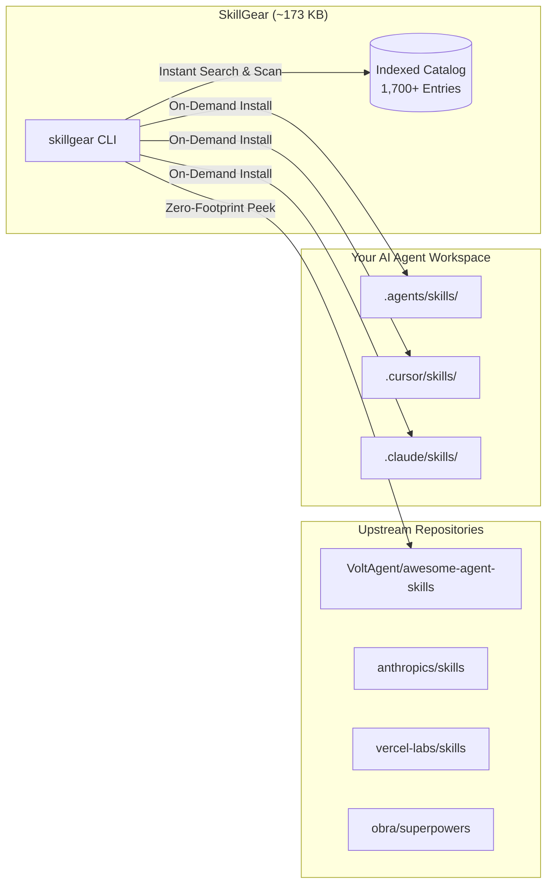

# SkillGear ⚙️

<p align="center">
  
</p>

<p align="center">
  <strong>The intelligent, offline-first skill engine for AI coding agents.</strong><br/>
  Search, scan, preview, and activate from <strong>1,700+ curated agent skills</strong> directly into your workspace.
</p>

<p align="center">
  <a href="https://www.npmjs.com/package/skillgear"></a>
  <a href="https://www.npmjs.com/package/skillgear"></a>
  <a href="LICENSE"></a>
  <a href="https://nodejs.org">=18.0.0-54a0ff.svg?style=for-the-badge&logo=node.js&logoColor=white" alt="Node Version" /></a>
  <a href="https://github.com/netomartins/skillgear"></a>
</p>

---

## ⚡ The Problem vs. The SkillGear Solution

| The Old Way ❌ | The SkillGear Way 🚀 |
|---|---|
| **Repository Bloat:** Storing 1,700+ skills requires **~65MB** and 5,700+ markdown files in your repo. | **Ultralight Package:** Pre-indexed catalog in **< 900KB** (173 kB compressed). Zero disk bloat. |
| **Manual Hunting:** Guessing which skill fits your current tech stack. | **Intelligent Scan:** Auto-detects dependencies (`Next.js`, `Tailwind`, `FastAPI`, `Docker`, etc.) and recommends the best skills. |
| **Context Window Waste:** Injecting unnecessary skills into agent context. | **Zero-Footprint Peek:** Read/preview any `SKILL.md` instantly from upstream source without saving files. |
| **Vendor Lock-in:** Different paths for Cursor, Antigravity, Claude Code, and Copilot. | **Universal Compatibility:** Automatically maps to `.agents/skills`, `.cursor/skills`, or `.claude/skills`. |

---

## 📸 CLI in Action

<p align="center">
  
</p>

---

## 🚀 Quick Start (Zero Setup Needed)

Run instantly anywhere via `npx` without installing anything:

```bash
# 1. Automatically detect your project's stack and get recommended skills
npx skillgear scan

# 2. Search through 1,700+ skills
npx skillgear search "nextjs auth"

# 3. Preview a skill without saving to disk
npx skillgear peek nextjs-app-router-patterns

# 4. Install a skill for your AI agent
npx skillgear install nextjs-app-router-patterns
```

Or install globally on your system:

```bash
npm install -g skillgear
```

---

## 🛠️ CLI Commands & Usage

### 1. `skillgear scan [directory]`
Inspects your project environment (`package.json`, `requirements.txt`, `go.mod`, `Cargo.toml`, `Dockerfile`, `terraform`, `supabase`, etc.) and suggests matching agent skills.

```bash
skillgear scan
```
*Output:*
```text
🔎 Scanning project stack in: C:\Projects\my-saas

  Detected Technologies:
  ● nextjs           (package.json)
  ● tailwind         (package.json)
  ● prisma           (package.json)
  ● typescript       (package.json)

  Recommended Skills for your Stack:
  → nextjs-app-router-patterns [nextjs, react, app-router]
  → tailwind-best-practices [tailwind, css, frontend]
  → prisma-postgres-optimizer [prisma, postgres, database]
  → typescript-expert [typescript, programming]
```

---

### 2. `skillgear search <query>`
Searches through 1,700+ indexed skills using a weighted relevance algorithm (matching title, tags, category, and description).

```bash
skillgear search "supabase auth"
skillgear search "playwright test" --limit 5
```

---

### 3. `skillgear peek <skill-name>`
**Zero-footprint preview.** Fetches the latest `SKILL.md` directly from the original upstream repository and renders it with syntax highlighting in your terminal. **No files are saved on disk.**

```bash
skillgear peek test-driven-development
```

---

### 4. `skillgear install <skill-name>`
Downloads and installs the specified skill into your local workspace or user profile, automatically detecting your IDE.

```bash
# Auto-detects whether you are using Antigravity, Cursor, or Claude Code
skillgear install test-driven-development

# Force target a specific agent environment
skillgear install nextjs-app-router-patterns --target cursor
skillgear install nextjs-app-router-patterns --target claude
skillgear install nextjs-app-router-patterns --target antigravity

# Install globally in your home directory (~/.agents/skills)
skillgear install docker-expert --global
```

---

### 5. `skillgear list`
Lists all skills currently installed in the workspace or globally.

```bash
skillgear list
skillgear list --global
```

---

### 6. `skillgear update`
Checks for and downloads catalog updates directly from the official upstream repository.

```bash
skillgear update
```

---

## 🎯 Supported IDEs & Agent Ecosystems

SkillGear seamlessly integrates with all major AI coding agents:

| Environment | Project Local Target | Global Target | Auto-Detection |
|---|---|---|:---:|
| **Google Antigravity** | `.agents/skills/<name>/` | `~/.agents/skills/<name>/` | ✅ |
| **Cursor** | `.cursor/skills/<name>/` | `~/.cursor/skills/<name>/` | ✅ |
| **Claude Code** | `.claude/skills/<name>/` | `~/.claude/skills/<name>/` | ✅ |
| **GitHub Copilot** | `.github/skills/<name>/` | — | ✅ |

---

## 🏗️ Architecture & How It Works



---

## 🤝 Attribution & Ethical Open-Source

SkillGear indexer does not claim ownership or redistribute proprietary packages. All skills indexed by SkillGear are fetched on-demand from their original community authors and repositories:
- **VoltAgent / awesome-agent-skills**
- **Anthropic Skills** (`anthropics/skills`)
- **Vercel Labs** (`vercel-labs/skills`)
- **Obra Superpowers** (`obra/superpowers`)

See [ATTRIBUTION.md](ATTRIBUTION.md) for full license notices.

---

## 📄 License

MIT License © 2026 [Neto Martins](https://github.com/netomartins).
